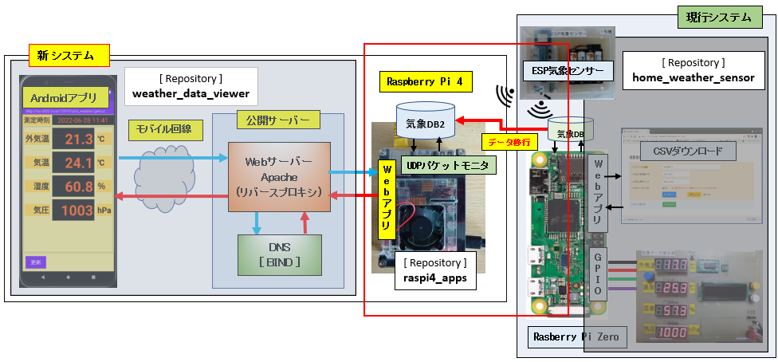

## UDP Weather Sensor packet monitor for Raspberry pi 4

## 1. 本リポジトリの範囲

+ 本リポジトリは、下記システム図の中の赤枠の部分となります。
+ Raspberry Pi OS (64-bit) をインストールした Raspberry pi (4 ModelB / 8G) に Androidスマホアプリ向けのWebアプリケーションサービスを構築する方法を紹介します。

<div>

</div>
<br/>

### 1-1. システム構成

+ OS: Raspberry Pi OS with desktop (64-bit)  
  Debian version: 11 (bullseye)  
  ※1. OSインストール後は **ランレベル=3 (muli-user.target) に設定し GUIは使用しない**  
  ※2. リモートからターミナルでSSH接続するので、キーボード、ディスプレイ、マウスは不要。

  ```bash
  pi@raspi-4:~ $ uname -a
  Linux raspi-4 5.15.32-v8+ #1538 SMP PREEMPT Thu Mar 31 19:40:39 BST 2022 aarch64 GNU/Linux
  ```  

+ 気象データDB (コンテナの生成・破棄: システムサービス)   
  Dockerコンテナ内の PostgreSQL 12

+ UDPパケットモニタリングアプリケーション (システムサービス)  
  python 標準の socketライブラリ

+ Webアプリケーション (システムサービス)  
  (1) Flask (WSGIサーバー: waitress): レスポンスデータ形式 Json  
  (2) 気象データの可視化と画像生成: pandas + matplotlib


### 1-2. 気象データDBのマイグレーション

+ Raspberry Pi Zero の 気象データDB (SQLite3) を dockerコンテナ上の PostgreSQL12 に移行  
  (1) scpコマンドで [Raspberry Pi Zero] の気象データDBを [Raspberry Pi 4] にコピー  
  (2) 気象データDBからCSVエクスポートスクリプトによりCSVファイルを出力  
  (3) CSVファイルを PostgreSQL12の気象データデーブルにインポート

<div>

</div>
<br/>


### 1-3. アプリケーションサービス

+ Raspberry Pi 4 には 下記のアプリケーションサービスを稼働させます  
 (1) **udp-weather-mon**: ESP気象センサーのUDPパケットを受信し気象データDBに記録  
 (2-A) **postgres-12-docker**: PostgreSQLコンテナイメージ生成  
 (2-B) **cleanup-postgres-12-docker**: PostgreSQLコンテナイメージ破棄  
 (3) **webapp-plot-weather**: 気象データのMatplotlib画像出力Webアプリケーション

<div>

</div>
<br/>

### 1-4. ソースの構成

```
src/
├── PlotWeatherForRaspi4  # Flask Webアプリケーション
├── bin                   # UDPパケットモニタリングアプリケーション
│   ├── pigpio
│   │   ├── conf
│   │   │   ├── dbconf.json
│   │   │   └── logconf_service_weather.json
│   │   ├── database
│   │   │   ├── __init__.py
│   │   │   └── pgdatabase.py
│   │   ├── db
│   │   │   ├── __init__.py
│   │   │   ├── sqlite3conv.py
│   │   │   └── weatherdb.py
│   │   ├── log
│   │   │   ├── __init__.py
│   │   │   └── logsetting.py
│   │   └── UdpMonitorFromWeatherSensor.py
│   ├── postgres-12-docker.sh
│   └── udp_monitor_from_weather_sensor.sh
├── data
│   └── sql                             # 気象データDB(SQLite3) 移行スクリプト 
│       ├── csv
│       ├── sqlite3db
│       ├── getcsv_from_device.sh
│       ├── getcsv_from_weather.sh
│       └── import_all_csv.sh
├── db
│   └── postgresql                      # データベース格納ディレクトリ
├── docker
│   └── postgres                         # docker-compose実行ディレクトリ
│       ├── initdb
│       │   ├── 01_create_weather.sh    # 気象データデーベース作成シェルスクリプト
│       │   ├── 10_createdb_sensors.sql # データデーベース作成SQL
│       │   └── 11_weather_db.sql       # テーブル生成SQL
│       ├── Dockerfile
│       └── docker-compose.yml
├── logs
│   └── pigpio                           # ログ出力ディレクトリ
├── work
│   ├── etc                             # システムサービス設定ファイル
│   │   ├── default
│   │   │   ├── postgres-12-docker    # postgres-12-docker.service用環境変数
│   │   │   └── webapp-plot-weather   # webapp-plot-weather.service用環境変数
│   │   └── systemd
│   │       └── system
│   │           ├── cleanup-postgres-12-docker.service
│   │           ├── postgres-12-docker.service
│   │           ├── udp-weather-mon.service
│   │           └── webapp-plot-weather.service
│   └── requirements.txt                 # Pythonライブラリ
├── 1_inst_udpmon.sh                      # 1.UDPパケットモニタアプリ用インストーラー
├── 2_create_postgresql_container.sh      # 2.PostgreSQLデータベース作成用スクリプト
├── 3_migrate_weatherdb.sh                # 3.気象データDBマイグレーション用スクリプト
├── 4_inst_webapp.sh                      # 4.Webアプリ用インストーラー
└── .fonts
      └──  IPAexfont00401                 # IPAフォント (True type)
             ├── ipaexg.ttf               # Matplotlib の "matplotlibrc" ファイルで参照
             └── ipaexm.ttf
```

## 2. インストールスクリプト

### 2-1. インストール前作業

ログインパスワード無しで Raspberry pi zero からファイルを自動コピーするための作業  

+ (1) **ssh-keygen** で秘密鍵・公開鍵のペアを生成する ※ Enter passphrase は **Enter**

   ```bash
   pi@raspi-4:~/.ssh $ ssh-keygen -f id_rsa_raspi-4
   Generating public/private rsa key pair.
   Enter passphrase (empty for no passphrase): 
   Enter same passphrase again: 
   Your identification has been saved in id_rsa_raspi-4
   Your public key has been saved in id_rsa_raspi-4.pub
   The key fingerprint is:
   SHA256:e+MIZ9lr7S8C/gcfExGky1ReDZUdXYfRrmQwXlHygRc pi@raspi-4
   The key's randomart image is:
   +---[RSA 3072]----+
   |           .+.BE%|
   |           ++oo=B|
   |          o..=...|
   |         o .o o .|
   |        S o  + . |
   |        .+. o .  |
   |      ..=.++ o   |
   |       +.+oo=    |
   |        .o++.o.  |
   +----[SHA256]-----+ 
   ```

+ (2) (1)で生成した公開鍵を Raspberry pi zero にコピーする  
   Raspberry pi zero piユーザのパスワードを入力

   ```bash
   pi@raspi-4:~/.ssh $ scp id_rsa_raspi-4.pub pi@raspi-zero:~/work
   The authenticity of host 'raspi-zero (192.168.0.12)' can't be established.
   ECDSA key fingerprint is SHA256:h5vFhvICqLRDVz0kDLlIlygzvCKVog7S+wIR7uWqzM8.
   Are you sure you want to continue connecting (yes/no/[fingerprint])? yes
   Warning: Permanently added 'raspi-zero,192.168.0.12' (ECDSA) to the list of known hosts.
   pi@raspi-zero's password: 
   id_rsa_raspi-4.pub   100%  564   169.8KB/s   00:00
   ```

+ (3) Raspberry pi zero に SSHでログインし**公開鍵を .ssh/authorized_keys**に追加する  
   Raspberry pi zero piユーザのパスワードを入力  

   ```bash
   pi@raspi-zero:~/work$ cat id_rsa_raspi-4.pub >> ~/.ssh/authorized_keys 
   pi@raspi-zero:~/work$ chmod 600 ~/.ssh/authorized_keys  # chmod 600 これは必須
   pi@raspi-zero:~/work$ ls -lt ~/.ssh
   合計 8
   -rw------- 1 pi pi 962  8月  5 11:33 authorized_keys
   -rw-r--r-- 1 pi pi 222 11月 16  2021 known_hosts
   ```

+ (4) 一旦 Raspberry pi zero をログアウトし、再度 SSH でログインする。  
  **パスワード入力が要求されなくなることを確認します**


### 2-2. UDPパケットモニタアプリ用インストーラー

インストーラーの説明
```
(0) コメント: インストーラー実行前に piユーザのパスワードをエクスポート
   (例) piユーザのパスワードが"piuserpadd"の場合
      export my_passwd=piuserpadd

(1) "raspi-4.local"のホスト名を生成し hostsファイルに追加する
  OSインストール直後の /etc/hosts 下記のようになっています
   ※ "raspi-4" の部分はインストール後に config
    127.0.0.1	localhost
    ...
    127.0.1.1	raspi-4
  追加後の/etc/hosts: WebアプリのURL、PostgreSQLのホスト名参照が可能になる
    192.168.0.16 raspi-4.local

(2) sqlite3, docker-compose (dockerは自動でインストールされる)のインストール
(3) PYthon仮想環境の生成; [仮想環境名] raspi4_apps
(4) PYthon仮想環境にPythonパッケージをインストール: 下記の実行と同じです
   ※ pip install flask waitress pandas matplotlib
(5) piユーザにdockerグループを追加する
   ※ sudo なしで dockerコマンドを実行する
(6) Webアプリ以外のシステムサービスをインストールする
   ※但し、このスクリプトでは起動しない      
```

[1_inst_udpmon.sh]
```bash
#!/bin/bash

# execute before export my_passwd=xxxxxx                                (0)

# Add [ip address] [hostname].local in /etc/hosts                       (1)
ip_addr=$(ifconfig eth0 | grep "inet " | awk '{ print $2 }')
host_in_hosts=$(cat /etc/hosts | grep 127.0.1.1 | awk '{ print $2 }')
host_in_hosts="${host_in_hosts}.local"
add_dot_host="${ip_addr}		${host_in_hosts}"
echo $my_passwd | { sudo --stdin chown pi.pi /etc/hosts
  echo $add_dot_host>>/etc/hosts
  sudo chown root.root /etc/hosts
}

echo $my_passwd | { sudo --stdin apt update && sudo apt -y upgrade
   sudo apt -y install sqlite python3-venv docker-compose               # (2)
   sudo apt -y autoremove
}

# Create Virtual Python environment.
if [ ! -d "$HOME/py_venv" ]; then
   mkdir py_venv
fi

cd py_venv
python3 -m venv raspi4_apps                                            # (3)
. raspi4_apps/bin/activate
pip install -U pip
# requirements.txt in psycopg2-binary flask waitress pandas matplotlib libraries.
pip install -r ~/work/requirements.txt                                 # (4)
exit1=$?
echo "Install requirements libraries into raspi4_apps >> status=$exit1"
deactivate
if [ $exit1 -ne 0 ]; then
   exit $exit1
fi

cd ~/

# docker execute to pi
echo $my_passwd | sudo --stdin gpasswd -a pi docker                    # (5)

# Enable pigpio app system services                                      (6)
echo $my_passwd | { sudo --stdin cp ~/work/etc/default/postgres-12-docker /etc/default
  sudo cp ~/work/etc/systemd/system/postgres-12-docker.service /etc/systemd/system
  sudo cp ~/work/etc/systemd/system/cleanup-postgres-12-docker.service /etc/systemd/system
  sudo cp ~/work/etc/systemd/system/udp-weather-mon.service /etc/systemd/system
  sudo systemctl enable postgres-12-docker.service
  sudo systemctl enable cleanup-postgres-12-docker.service
  sudo systemctl enable udp-weather-mon.service
}

echo "Done, logout this terminqal."
```

上記スクリプトを実行後、**一旦 Raspberry Pi 4 からログアウトします。**  
**※ログアウトしないと (5) が反映されず、気象データDBのマイグレーションに失敗します。**


### 2-3. PostgreSQL12 Dockerコンテナ生成インストーラー

[2_create_postgresql_container.sh]
```bash
#!/bin/bash

# Create PostgreSQL container with sensors_pgdb database and weather data tables.
cd ~/docker/postgres
docker-compose up --build -d
exit1=$?
echo "Docker create PostgreSQL container >> status=$exit1"
docker-compose down
if [ $exit1 -ne 0 ]; then
   exit $exit1
fi

cd ~/
echo "Done."
```

#### 2-3-1. データベース生成SQL  

[docker/postgres/initdb/10_createdb_sensors.sql]  
```SQL
CREATE ROLE developer WITH LOGIN PASSWORD 'abcdefg';
--install pgcrypto that is required superuser. 
ALTER ROLE developer WITH SUPERUSER;
CREATE DATABASE sensors_pgdb WITH OWNER=developer ENCODING='UTF-8' LC_COLLATE='ja_JP.UTF-8' LC_CTYPE='ja_JP.UTF-8' TEMPLATE=template0;
GRANT ALL PRIVILEGES ON DATABASE sensors_pgdb TO developer;
```

#### 2-3-2. テーブル生成SQL  

[docker/postgres/initdb/11_weather_db.sql]
```SQL
\connect sensors_pgdb

CREATE SCHEMA IF NOT EXISTS weather;

CREATE TABLE IF NOT EXISTS weather.t_device(
   id INTEGER NOT NULL,
   name VARCHAR(20) UNIQUE NOT NULL,
   CONSTRAINT pk_device PRIMARY KEY (id)
);

CREATE TABLE IF NOT EXISTS weather.t_weather(
   did INTEGER NOT NULL,
   measurement_time timestamp NOT NULL,
   temp_out REAL,
   temp_in REAL,
   humid REAL,
   pressure REAL
);

ALTER TABLE weather.t_weather ADD CONSTRAINT pk_weather PRIMARY KEY (did, measurement_time);

ALTER TABLE weather.t_weather ADD CONSTRAINT fk_device FOREIGN KEY (did) REFERENCES weather.t_device (id);

ALTER SCHEMA weather OWNER TO developer;
ALTER TABLE weather.t_device OWNER TO developer;
ALTER TABLE weather.t_weather OWNER TO developer;
```

#### 2-3-3. Docker関連ファイル

+ Dockerフアイル [docker/postgres/Dockerfile]
   ```docker
   FROM postgres:12-alpine

   COPY initdb/*.sql /docker-entrypoint-initdb.d/
   ```
+ Docker-compose用環境設定ファイル [docker/postgres/.env]   
  ※開発環境 (/home/[develoer user]) と本番環境 (/home/pi)の切替が容易になります
   ```
   #COMPOSE_PROJECT_NAME=postgres-12
   HOST_PG_VOLUME=/home/pi/db
   #DB_NAME=sensors_pgdb
   PG_USER=postgres
   PG_PASSWD=yourpassword

   # display locale
   LANG=C

   # locale
   LANGUAGE=ja_JP:ja
   LC_ALL=ja_JP.UTF-8
   # Time zone
   TZ=Asia/Tokyo

   # volume mount
   HOST_HOME=/home/pi
   CONTAINER_HOME=/home/pi
   ```

+ docker-composeファイル [docker/postgres/docker-compose.yml]
   ```docker
   version: '3'
   services:
   postgres:
      build: .
      container_name: postgres-12
      env_file: ./.env
      ports:
         - "5432:5432"
      volumes:
         - "${HOST_PG_VOLUME}/postgresql/data:/var/lib/postgresql/data"
         - "${HOST_HOME}/data/sql:${CONTAINER_HOME}/data/sql"
      environment:
         - POSTGRES_USER=${PG_USER}
         - POSTGRES_PASSWORD=${PG_PASSWD}
   ```

### 2-4. マイグレーションインストーラー

インストーラーの説明

```
(1) Raspi-zeroから気象データDBをコピーする
  (1-B) コピーに失敗したら処理を継続しない
(2) CSV出力スクリプト
  (2-1) 観測機器テーブルCSV出力シェルスクリプト
  (2-2) 気象データテーブルCSV出力シェルスクリプト
   (2-B) CSV出力に失敗したら処理を継続しない
(3) PostgreSQLコンテナを生成する
  (3-B) 生成に失敗したら処理を継続しない
(4) (2)で出力したCSVを PostgreSQLにインポートする
(5) PostgreSQLコンテナを破棄する
```

[3_migrate_weatherdb.sh]
```bash
#!/bin/bash

# This script execute before 1_inst_udpmon.sh execute and logout terminal.
#  before export my_passwd=xxxxx

# [usage] ./migrade_weather from-date 
#    from-date required (exmaple) 2022-01-01  

# Migrate SQLite3 weather.db (export csv) into PostgeSQL 
# scp from raspi-zero:SQLite3 weather.db 
scp pi@raspi-zero:~/db/weather.db ~/data/sql/sqlite3db      # (1)
exit1=$?
echo "scp paspi-zero:weather.db into sqlite3db directory >> status=$exit1"
if [ $exit1 -ne 0 ]; then
   exit $exit1                             # (1-B)
fi

cd ~/data/sql

export PATH_WEATHER_DB=~/data/sql/sqlite3db/weather.db
./getcsv_from_device.sh --output-path csv                                          # (2-1)
./getcsv_from_weather.sh --device-name esp8266_1 --from-date $1 --output-path csv  # (2-2)
exit1=$?
echo "export SQLite3 db to weather.csv >> status=$exit1"
if [ $exit1 -ne 0 ]; then
   exit $exit1                             # (2-B)
fi

cd ~/docker/postgres

docker-compose up -d                        # (3)
exit1=$?
echo "docker-compose up -d >> status=$exit1"
if [ $exit1 -ne 0 ]; then
   exit $exit1                              # (3-B)
fi

# wait starting pg_ctl in container.
sleep 2

docker exec -it postgres-12 sh -c "$HOME/data/sql/import_all_csv.sh"  # (4)
exit1=$?
echo "docker exec import_all_csv.sh >> status=$exit1"

docker-compose down                         # (5)

cd ~

echo "SQLite3 weatherdb migration to PostgreSQL complete!"

```

### 2-4-1. 観測機器テーブルCSV出力シェルスクリプト

+ [data/sql/csv] ディレクトリに "device.csv" を出力する

[data/sql/getcsv_from_device.sh]
```bash
#!/bin/bash

readonly SCRIPT_NAME=${0##*/}

PATH_EXPORT_CSV="$HOME/Downloads/csv"

print_error()
{
   cat << END 1>&2
$SCRIPT_NAME: $1
Try --help option
END
}

query() {
   sqlite3 -cmd 'PRAGMA foreign_key=ON' "$PATH_WEATHER_DB" "$@"
}

get_csv() {
cat<<-EOF | query -csv
    SELECT id, name FROM t_device ORDER BY id;
EOF
}

params=$(getopt -n "$SCRIPT_NAME" \
       -o o: \
       -l help -l output-path: \
       -- "$@")

# Check command exit status
if [[ $? -ne 0 ]]; then
  echo 'Try --help option for more information' 1>&2
  exit 1
fi
eval set -- "$params"

# init option value
output_path=$PATH_EXPORT_CSV

# Parse options
# Positional parameter count: $#
while [[ $# -gt 0 ]]
do
  case "$1" in
    -o | --output-path)
      output_path=$2
      shift 2
      ;;
    --help)
      print_help
      exit 0
      ;;
    --)
      shift
      break
      ;;
  esac
done

filename="device.csv"

header='"id","name"'
echo $header > "$output_path/$filename"
get_csv >> "$output_path/$filename"
if [ $? = 0 ]; then
   echo "Output device csv to $output_path/$filename"
   row_count=$(cat "${output_path}/${filename}" | wc -l)
   row_count=$(( row_count - 1))
   echo "Record count: ${row_count}" 
fi   
```

### 2-4-2. 気象データテーブルCSV出力シェルスクリプト

+ 観測機器名 "esp8266_1" で --from-date 2021-11-01 [観測開始日付] で指定されたレコードを抽出
+ [data/sql/csv] ディレクトリに "weather.csv" を出力する

[data/sql/getcsv_from_weather.sh]
```bash
#!/bin/bash

readonly SCRIPT_NAME=${0##*/}

PATH_EXPORT_CSV="$HOME/Downloads/csv"

print_error()
{
   cat << END 1>&2
$SCRIPT_NAME: $1
Try --help option
END
}

query() {
   sqlite3 -cmd 'PRAGMA foreign_key=ON' "$PATH_WEATHER_DB" "$@"
}

next_to_date() {
    retval=$(date -d "$1 1 days" +'%F');
    echo "$retval"
}


get_csv() {
    dev_name="$1";
    where="$2";
cat<<-EOF | query -csv
    SELECT
      did,
      datetime(measurement_time, 'unixepoch', 'localtime'), 
      temp_out, temp_in, humid, pressure
    FROM
      t_weather wh INNER JOIN t_device dv ON wh.did = dv.id
    WHERE
      dv.name='${dev_name}' AND (${where})
    ORDER BY measurement_time;
EOF
}

params=$(getopt -n "$SCRIPT_NAME" \
       -o d:f:t:o: \
       -l device-name: -l from-date: -l to-date: -l output-path: -l help \
       -- "$@")

# Check command exit status
if [[ $? -ne 0 ]]; then
  echo 'Try --help option for more information' 1>&2
  exit 1
fi
eval set -- "$params"

# init option value
device_name=
from_date=
to_date=
output_path=$PATH_EXPORT_CSV

# Parse options
# Positional parameter count: $#
while [[ $# -gt 0 ]]
do
  case "$1" in
    -d | --device-name)
      device_name=$2
      shift 2
      ;;
    -f |--from-date)
      from_date=$2
      shift 2
      ;;
    -t | --to-date)
      to_date=$2
      shift 2
      ;;
    -o | --output-path)
      output_path=$2
      shift 2
      ;;
    --help)
      print_help
      exit 0
      ;;
    --)
      shift
      break
      ;;
  esac
done

# Check required option: --device-name
if [ -z "$device_name" ]; then
  print_error "Required --device-name xxxxx"
  exit 1
fi

where=
if [ -n "$from_date" ] && [ -n "$to_date" ]; then
   next_date=$(next_to_date "$to_date");
   where=" measurement_time >= strftime('%s','"$from_date"','-9 hours') AND measurement_time < strftime('%s','"$next_date"','-9 hours')"
   range_from=$(echo "${from_date}" | sed 's/-//g') 
   range_to=$(echo "${to_date}" | sed 's/-//g') 
fi
if [ -n "$from_date" ] && [ -z "$to_date" ]; then
   where=" measurement_time >= strftime('%s','"$from_date"','-9 hours')"
   range=$(echo "${from_date}" | sed 's/-//g') 
fi
if [ -z "$from_date" ] && [ -n "$to_date" ]; then
   next_date=$(next_to_date "$to_date");
   where=" measurement_time < strftime('%s','"$next_date"','-9 hours')"
   range=$(echo "${to_date}" | sed 's/-//g') 
fi
if [ -z "$from_date" ] && [ -z "$to_date" ]; then
   where=" 1=1"
fi
filename="weather.csv"

header='"did","measurement_time","temp_out","temp_in","humid","pressure"'
echo $header > "$output_path/$filename"
get_csv "$device_name" "$where" >> "$output_path/$filename"
if [ $? = 0 ]; then
   echo "Output weather csv to $output_path/$filename"
   row_count=$(cat "${output_path}/${filename}" | wc -l)
   row_count=$(( row_count - 1))
   echo "Record count: ${row_count}" 
fi   
```

### 2-4-3. CSVインポートシェルスクリプト

+ 観測機器テーブル、気象データテーブルの制約をDROPする
+ 観測機器CSV、気象データCSV をそれぞれのテーブルにインポートする  
  ※CSVファイルへのパスは絶対パスでなければならない
+ 制約を元に戻す

```bash
#!/bin/bash

# https://stackoverflow.com/questions/34736762/script-to-automat-import-of-csv-into-postgresql
#   Script to automat import of CSV into PostgreSQL

psql -Udeveloper -d sensors_pgdb -c "ALTER TABLE weather.t_weather DROP CONSTRAINT pk_weather;"
psql -Udeveloper -d sensors_pgdb -c "ALTER TABLE weather.t_weather DROP CONSTRAINT fk_device;"

# t_device.csv into t_device table
psql -Udeveloper -d sensors_pgdb -c "\copy weather.t_device FROM '/home/pi/data/sql/csv/device.csv' DELIMITER ',' CSV HEADER;"
# t_weather.csv into t_weather table
psql -Udeveloper -d sensors_pgdb -c "\copy weather.t_weather FROM '/home/pi/data/sql/csv/weather.csv' DELIMITER ',' CSV HEADER;"

# Rebuild constraint.
psql -Udeveloper -d sensors_pgdb -c "ALTER TABLE weather.t_weather ADD CONSTRAINT pk_weather PRIMARY KEY (did, measurement_time);"
psql -Udeveloper -d sensors_pgdb -c "ALTER TABLE weather.t_weather ADD CONSTRAINT fk_device FOREIGN KEY (did) REFERENCES weather.t_device (id);"
```

### 2-5. Webアプリケーションサービスインストーラー

+ フォントキャッシュをクリアする
+ Webアプリケーションサービスを有効にする
+ リブートする

[4_inst_webapp.sh]
```bash
#!/bin/bash

# execute before export my_passwd=xxxxxx

# .fonts/IPA-font
fc-cache -fv
fc-list | grep -i ipa

# Enable webapp service
echo $my_passwd | { sudo --stdin cp ~/work/etc/default/webapp-plot-weather /etc/default
  sudo cp ~/work/etc/systemd/system/webapp-plot-weather.service /etc/systemd/system
  sudo systemctl enable webapp-plot-weather.service
}

echo "rebooting."
echo $my_passwd |sudo --stdin reboot
```

## 3. システムサービスフアイル

### 3-1. UDPパケットモニタサービス

+ シェルスクリプトフアイル  
[bin/udp_monitor_from_weather_sensor.sh]
```
#!/bin/bash

. ${HOME}/py_venv/raspi4_apps/bin/activate

python ${HOME}/bin/pigpio/UdpMonitorFromWeatherSensor.py

deactivate
```

+ システムサービスフアイル  
[work/etc/systemd/system/udp-weather-mon.service]
```
[Unit]
Description=UDPClient Weather data monitor service
After=postgres-12-doker.service

[Service]
Type=simple
ExecStart=/home/pi/bin/udp_monitor_from_weather_sensor.sh
User=pi

[Install]
WantedBy=multi-user.target
```

### 3-2. Webアプリケーションサービス

+ シェルスクリプトフアイル  
[PlotWeatherForRaspi4/start.sh]
```
#!/bin/bash

# ./start.sh                    -> development
# ./start.sh prod | production  ->production

env_mode="development"
if [ $# -eq 0 ]; then
    :
else
   if [[ "$1" = "prod" || "$1" = "production" ]]; then 
        env_mode="production"
   fi
fi

host_name="$(/bin/cat /etc/hostname)"
IP_HOST_ORG="${host_name}.local"   # ADD host suffix ".local"
export IP_HOST="${IP_HOST_ORG,,}"  # to lowercase
export FLASK_ENV=$env_mode
echo "$IP_HOST with $FLASK_ENV"

EXEC_PATH=
if [ -n "$PATH_PLOT_WEATHER" ]; then
   EXEC_PATH=$PATH_PLOT_WEATHER
else
   EXEC_PATH="$HOME/PlotWeatherForRaspi4"
fi

. $HOME/py_venv/raspi4_apps/bin/activate

python $EXEC_PATH/run.py

deactivate
```

+ 環境変数ファイル  
[work/etc/default/webapp-plot-weather]
```bash
FLASK_PROD_PORT=12345
DB_CONN_MAX=3
```
+ システムサービスフアイル  
[work/etc/systemd/system/webapp-plot-weather.service]
```
[Unit]
Description=Flask webapp PlotWeather service
After=postgres-12-docker.service

[Service]
Type=idle
# FLASK_PROD_PORT
EnvironmentFile=/etc/default/webapp-plot-weather
ExecStart=/home/pi/PlotWeatherForRaspi4/start.sh prod >/dev/null
User=pi

[Install]
WantedBy=multi-user.target
```

### 3-3. PostgreSQLコンテナイメージ生成スクリプト

+ コンテナ生成処理の注意点
```
気象データDBを参照するためPostgreSQLコンテナ生成後に下記アプリケーションを起動する必要があります
  (1) UDPパケットモニタリングアプリケーション
  (2) Webアプリケーション
※1. コンテナ生成はそこそこに時間がかかります  
※2. 下記のような一般的な設定 (Type=simple) では、udp-weather-mon.service は後に起動されるものの
    PostgreSQLコンテナイメージ生成完了前に、udp-weather-mon.service の起動が完了してしまいます
```
<div>

</div>
<br/>

+ アプリケーシのデータベース接続エラー ※ログの時間列は省略しています  
  接続エラー箇所: **"could not connect to server: Network is unreachable"**
```
udp_monitor_from_weather_sensor.sh[470]:     self.conn = psycopg2.connect(**dbconf)
udp_monitor_from_weather_sensor.sh[470]:   File "/home/pi/py_venv/raspi4_apps/lib/python3.9/site-packages/psycopg2/__init__.py", >
udp_monitor_from_weather_sensor.sh[470]:     conn = _connect(dsn, connection_factory=connection_factory, **kwasync)
udp_monitor_from_weather_sensor.sh[470]: psycopg2.OperationalError: could not connect to server: Network is unreachable
udp_monitor_from_weather_sensor.sh[470]:         Is the server running on host "raspi-4.local" (192.168.0.16) and accepting
udp_monitor_from_weather_sensor.sh[470]:         TCP/IP connections on port 5432?
udp_monitor_from_weather_sensor.sh[470]: could not connect to server: Network is unreachable
udp_monitor_from_weather_sensor.sh[470]:         Is the server running on host "raspi-4.local" (192.168.0.16) and accepting
udp_monitor_from_weather_sensor.sh[470]:         TCP/IP connections on port 5432?
```
+ Type=**notify** と シェルスクリプト側 [ **system-notify** --ready ] の組み合わせにより、コンテナ生成後にアプリケーシを起動することができます。

<div>

</div>
<br/>

+ シェルスクリプトの説明 

```
(1) docker-composeコマンドの絶対パスを取得する
  ※1. 環境に依存しないようコマンド置換を使う 　
  ※2. 開発環境 (Ubuntu) と 本番環境 (Raspberry pi) でコマンドパスが異なっています
  [Ubuntu 18.04]
  $ uname -a
  Linux Dell-T7500 5.4.0-124-generic #140~18.04.1-Ubuntu ...一部省略...
  $ which docker-compose
  /usr/local/bin/docker-compose

  [Raspberry pi OS]
  $ uname -a
  Linux raspi-4 5.15.32-v8+ #1538 SMP PREEMPT Thu Mar 31 19:40:39 BST 2022 aarch64 GNU/Linux
  $ which docker-compose
  /usr/bin/docker-compose

(2) バックグラウンドで PostgeSQLコンテナを生成
  (2-B) 生成処理完了後に [system-notify --ready] コールする
  ※ udp-weather-mon.service が起動される

(3) PostgeSQLコンテナを破棄   
```

+ man **systemd-notify** の抜粋

```
pi@raspi-4:~ $ man systemd-notify
....
NAME
  systemd-notify - Notify service manager about start-up completion and other daemon status changes

SYNOPSIS
  systemd-notify [OPTIONS...] [VARIABLE=VALUE...]

OPTIONS
  --ready
   Inform the init system about service start-up completion. This is equivalent to systemd-notify READY=1. 
   For details about the semantics of this option see sd_notify(3).
```

+ PostgreSQLコンテナ生成・破棄シェルスクリプト  
  [bin/**postgres-12-docker.sh]

```bash
#!/bin/bash

docker_compose=$(which docker-compose)       # (1)

case "$1" in
  start)
    cd $2 # Directory in docker-compose.yml
    $docker_compose up -d                    # (2)
    systemd-notify --ready                   # (2-B)
    echo "PostgreSQL container ready!"
    # After udp-weather-mon.service, webapp-plot-weather.service
    cd ~
    ;;
  stop)
    # At shutdown
    cd $2
    $docker_compose down                     # (3)
    echo "PostgreSQL container down."
    cd ~
    ;;
  *)
    exit 1
    ;; 
esac
```  

+ 環境変数ファイル  
  [work/etc/default/**postgres-12-docker**]
```bash
BUILD_PATH=/home/pi/docker/postgres
```

+ システムサービスファイル  
  [work/etc/systemd/system/**postgres-12-docker.service**]
```
[Unit]
Description=PostgreSQL Start service with docker
Before=udp-weather-mon.service webapp-plot-weatherr.service
After=docker.service

[Service]
Type=notify
TimeoutStartSec=0
NotifyAccess=all
EnvironmentFile=/etc/default/postgres-12-docker
ExecStart=/bin/sh -c "/home/pi/bin/postgres-12-docker.sh start $BUILD_PATH"
User=pi

[Install]
WantedBy=multi-user.target
```

### 3-4. 参考書

+ 上記 **notify (system-notiry)** については下記書籍に詳しい用例が掲載されています。  
  [掲載箇所] **1.3.4 systemd-notirfy を使う**
+ 発行日がだいぶ古くなっていますが、掲載されている用例は最新のRaspberry pi OS でも問題なく動作します。  
  ※実機にインストールする前に、開発機 (Ubuntu 18.04) で検証しています。 

```
[書名]
  CentOS 7 システム管理ガイド
  systemd / NetworkManager
  Firewalld徹底攻略
[発行日]
  2015年11月 1日 第1版第1刷
[ISBM]
  978-4-7980-4491-0 C55   
```

<div>

</div>
<br/>

## 4. Raspberry pi 4 にアプリケーションをインストール

+ Raspberry Pi OS with desktop インストール後の **pi** ユーザのホームディレクトリ

```bash
pi@raspi-4:~ $ ls -al
合計 9792
drwxr-xr-x 24 pi   pi      4096  8月  5 20:44 .
drwxr-xr-x  3 root root    4096  4月  4 23:56 ..
-rw-------  1 pi   pi        56  7月 30 17:32 .Xauthority
-rw-------  1 pi   pi       716  8月  5 11:41 .bash_history
-rw-r--r--  1 pi   pi       220  4月  4 23:28 .bash_logout
-rw-r--r--  1 pi   pi      3523  4月  4 23:28 .bashrc
drwxr-xr-x  5 pi   pi      4096  4月  5 00:04 .cache
drwx------  9 pi   pi      4096  7月 30 17:28 .config
drwxr-xr-x  3 pi   pi      4096  8月  5 19:20 .fonts
drwxr-xr-x  3 pi   pi      4096  4月  4 23:36 .local
-rw-r--r--  1 pi   pi       807  4月  4 23:28 .profile
drwx------  2 pi   pi      4096  8月  5 11:18 .ssh
drwx------  3 pi   pi      4096  4月  5 00:04 .vnc
-rw-------  1 pi   pi     14819  7月 30 17:31 .xsession-errors
drwxr-xr-x  2 pi   pi      4096  4月  4 23:36 Bookshelf
drwxr-xr-x  2 pi   pi      4096  4月  4 23:56 Desktop
drwxr-xr-x  2 pi   pi      4096  4月  4 23:56 Documents
drwxr-xr-x  2 pi   pi      4096  4月  4 23:56 Downloads
drwxr-xr-x  2 pi   pi      4096  4月  4 23:56 Music
drwxr-xr-x  2 pi   pi      4096  4月  4 23:56 Pictures
drwxr-xr-x  2 pi   pi      4096  4月  4 23:56 Public
drwxr-xr-x  2 pi   pi      4096  4月  4 23:56 Templates
drwxr-xr-x  2 pi   pi      4096  4月  4 23:56 Videos
```

### 4-1. アプリケーションアーカイブのコピー

+ 開発機 (Ubuntu) から 【1-4.ソースの構成】を tarアーカイブしたものを Raspberry pi 4 の **pi ユーザホーム**にコピー

```bash
$ scp raspi4_app.tar.gz pi@raspi-4:~
raspi4_app.tar.gz  100%  130KB   8.6MB/s   00:00    
```

### 4-2. Raspberry pi 4 にインストール

+ (1) アーカイブを解凍する

```bash
pi@raspi-4:~ $ ls -lrt
#...既存部分は省略...
-rw-r--r-- 1 pi pi 132670  8月  5 14:15 raspi4_app.tar.gz
# 解凍
pi@raspi-4:~ $ tar zxf raspi4_app.tar.gz 
pi@raspi-4:~ $ ls -lrt
#...既存部分は省略...
drwxr-xr-x 3 pi pi   4096  8月  3 14:18 docker
drwxr-xr-x 3 pi pi   4096  8月  3 14:18 logs
drwxr-xr-x 3 pi pi   4096  8月  3 14:18 data
drwxr-xr-x 3 pi pi   4096  8月  3 14:23 PlotWeatherForRaspi4
-rwxr-xr-x 1 pi pi    307  8月  3 14:45 3_inst_webapp.sh
drwxr-xr-x 3 pi pi   4096  8月  3 16:19 work
drwxr-xr-x 3 pi pi   4096  8月  4 15:56 bin
-rwxr-xr-x 1 pi pi   2008  8月  4 16:10 2_migrate_weatherdb.sh
-rwxr-xr-x 1 pi pi   1639  8月  5 11:04 1_inst_udpmon.sh
-rw-r--r-- 1 pi pi 132670  8月  5 14:15 raspi4_app.tar.gz
```

+ (2) 1_inst_udpmon.sh を実行する  
※1. 実行前に**環境変数 my_passwd に piユーザのパスワードを設定しエクスポートする**  
※2. ログは大量に出力されるため必要な部分のみを抜粋します
```bash
pi@raspi-4:~ $ export my_passwd=papayukio
pi@raspi-4:~ $ ./1_inst_udpmon.sh 
#...ログ一部省略...
ユーザ pi をグループ docker に追加
Created symlink /etc/systemd/system/multi-user.target.wants/postgres-12-docker.service → /etc/systemd/system/postgres-12-docker.service.
Created symlink /etc/systemd/system/multi-user.target.wants/udp-weather-mon.service → /etc/systemd/system/udp-weather-mon.service.
Done, logout this terminqal.
```

+ (3) 一旦ログアウトし、再度SSHでログインします。  
  ※さらに piユーザにdockerグループが追加されているか確認します

```bash
pi@raspi-4:~ $ exit
ログアウト
Connection to raspi-4 closed.
$ ssh pi@raspi-4
#...一部省略...
pi@raspi-4:~ $ id
uid=1000(pi) gid=1000(pi) groups=1000(pi),4(adm),20(dialout),24(cdrom),27(sudo),29(audio),44(video),46(plugdev),60(games),100(users),104(input),106(render),108(netdev),117(lpadmin),124(docker),997(gpio),998(i2c),999(spi)
```

+ (4) 2_create_postgresql_container.sh を実行する

```bash
pi@raspi-4:~ $ ./2_create_postgresql_container.sh 
Creating network "postgres_default" with the default driver
Building postgres
Step 1/2 : FROM postgres:12-alpine
12-alpine: Pulling from library/postgres
f97344484467: Pull complete
204fa37ad79b: Pull complete
3a550a0032f8: Pull complete
ed4eb55e06b7: Pull complete
7ee7a06c28a9: Pull complete
b340120c65e2: Pull complete
2f531d225db4: Pull complete
39ddcfdde1ee: Pull complete
Digest: sha256:2ecec7c3e880d004ff2c941ee5553c347b602ab839daf8a46aeba7cedb51ccaf
Status: Downloaded newer image for postgres:12-alpine
 ---> c616e3c0e730
Step 2/2 : COPY initdb/*.sql /docker-entrypoint-initdb.d/
 ---> 9024293e7aa2
Successfully built 9024293e7aa2
Successfully tagged postgres_postgres:latest
Creating postgres-12 ... done
Docker create PostgreSQL container >> status=0
Stopping postgres-12 ... done
Removing postgres-12 ... done
Removing network postgres_default
Done.
```

+ (5) 3_migrate_weatherdb.sh を実行する  
  ※1. スクリプトの引数にデータ移行開始日付("2022-11-01")をセット。  
  ※2. データ移行完了後直ちに**UDPパケットモニタリングサービスを起動**し新たな気象データを受信しデータベースに記録します。

```bash
pi@raspi-4:~ $ ./3_migrate_weatherdb.sh 2021-11-01
weather.db                            100% 2784KB   3.5MB/s   00:00    
scp paspi-zero:weather.db into sqlite3db directory >> status=0
getcsv_from_device.sh --output-path csv
Record count: 1
getcsv_from_weather.sh --device-name esp8266_1 --from-date 2021-11-01 --to-date  --output-path csv
Record count: 41095
export SQLite3 db to weather.csv >> status=0
Creating network "postgres_default" with the default driver
Creating postgres-12 ... done
docker-compose up -d >> status=0
ALTER TABLE
ALTER TABLE
COPY 1
COPY 41095
ALTER TABLE
ALTER TABLE
docker exec import_all_csv.sh >> status=0
Stopping postgres-12 ... done
Removing postgres-12 ... done
Removing network postgres_default
SQLite3 weatherdb migration to PostgreSQL complete!
UDP Monitor Service starting...
systemctl start postgres-12-docker.service >> status=0
systemctl start udp-weather-mon.service >> status=0
UDP Monitor Service started!
```

+ (6) 4_inst_webapp.sh を実行する  
  ※1. **フォントキャッシュのクリア**とインストールされたIPAフォントの確認  
  ※2. Webアプリケーションサービス有効化  
  ※3. リブート

```bash
pi@raspi-4:~ $ ./4_inst_webapp.sh 
/usr/share/fonts: caching, new cache contents: 0 fonts, 5 dirs
/usr/share/fonts/cMap: caching, new cache contents: 0 fonts, 0 dirs
/usr/share/fonts/cmap: caching, new cache contents: 0 fonts, 5 dirs
#...大量のため一部省略...
/home/pi/.cache/fontconfig: cleaning cache directory
/home/pi/.fontconfig: not cleaning non-existent cache directory
fc-cache: succeeded
/home/pi/.fonts/IPAexfont00401/ipaexg.ttf: IPAexゴシック,IPAexGothic:style=Regular
/home/pi/.fonts/IPAexfont00401/ipaexm.ttf: IPAex明朝,IPAexMincho:style=Regular
Created symlink /etc/systemd/system/multi-user.target.wants/webapp-plot-weatherr.service → /etc/systemd/system/webapp-plot-weatherr.service.
rebooting.
Connection to raspi-4 closed by remote host.
Connection to raspi-4 closed.
```

## 5. リブート後のサービス正常起動確認

### 5-1. PostgreSQLコンテナ生成サービス (起動順第１位)

```
pi@raspi-4:~ $ systemctl status postgres-12-docker.service 
● postgres-12-docker.service - PostgreSQL Start service with docker
     Loaded: loaded (/etc/systemd/system/postgres-12-docker.service; enabled; vendor preset: enabled)
     Active: inactive (dead) since Sat 2022-08-06 17:41:46 JST; 2min 8s ago
    Process: 759 ExecStart=/bin/sh -c /home/pi/bin/postgres-12-docker.sh start $BUILD_PATH (code=exited, status=0/SUCCESS)
   Main PID: 759 (code=exited, status=0/SUCCESS)
        CPU: 1.674s

 8月 06 17:41:42 raspi-4 systemd[1]: Starting PostgreSQL Start service with docker...
 8月 06 17:41:44 raspi-4 sh[762]: Creating network "postgres_default" with the default driver
 8月 06 17:41:44 raspi-4 sh[762]: Creating postgres-12 ...
 8月 06 17:41:46 raspi-4 systemd[1]: Started PostgreSQL Start service with docker.
 8月 06 17:41:46 raspi-4 sh[762]: [43B blob data]
 8月 06 17:41:46 raspi-4 sh[760]: PostgreSQL container ready!
 8月 06 17:41:46 raspi-4 systemd[1]: postgres-12-docker.service: Succeeded.
 8月 06 17:41:46 raspi-4 systemd[1]: postgres-12-docker.service: Consumed 1.674s CPU time.
```

### 5-2. UDPパケットモニタリングサービス (起動順第２位)

+ systemctl status udp-weather-mon.service

```
pi@raspi-4:~ $ systemctl status udp-weather-mon.service 
● udp-weather-mon.service - UDPClient Weather data monitor service
     Loaded: loaded (/etc/systemd/system/udp-weather-mon.service; enabled; vendor preset: enabled)
     Active: active (running) since Sat 2022-08-06 17:41:46 JST; 2min 17s ago
   Main PID: 992 (udp_monitor_fro)
      Tasks: 2 (limit: 8897)
        CPU: 260ms
     CGroup: /system.slice/udp-weather-mon.service
             ├─992 /bin/bash /home/pi/bin/udp_monitor_from_weather_sensor.sh
             └─995 python /home/pi/bin/pigpio/UdpMonitorFromWeatherSensor.py

 8月 06 17:41:46 raspi-4 systemd[1]: Started UDPClient Weather data monitor service.
```

### 5-3. Webアプリケーションサービス (起動順第３位)

+ systemctl status webapp-plot-weather.service

```
pi@raspi-4:~ $ systemctl status webapp-plot-weather.service
● webapp-plot-weather.service - Flask webapp PlotWeather service
     Loaded: loaded (/etc/systemd/system/webapp-plot-weather.service; enabled; vendor preset: enabled)
     Active: active (running) since Sat 2022-08-06 17:41:46 JST; 2min 27s ago
   Main PID: 993 (start.sh)
      Tasks: 6 (limit: 8897)
        CPU: 5.591s
     CGroup: /system.slice/webapp-plot-weather.service
             ├─993 /bin/bash /home/pi/PlotWeatherForRaspi4/start.sh prod >/dev/null
             └─997 python /home/pi/PlotWeatherForRaspi4/run.py

 8月 06 17:41:46 raspi-4 systemd[1]: Started Flask webapp PlotWeather service.
 8月 06 17:41:46 raspi-4 start.sh[993]: raspi-4.local with production
```

### 5-4. 気象データDBの新規登録確認

+ 新たに受信した気象データが登録ができているか確認します。  
[data/sql/Last_weather.sql]

```SQL
set search_path to weather;

SELECT
  *
FROM
  t_weather
WHERE
  measurement_time = (SELECT max(measurement_time) FROM t_weather WHERE did=(SELECT id FROM t_device WHERE name='esp8266_1'));
```

+ 実行中の PostgreSQL コンテナ内で **psql コマンド**を実行します。

```
pi@raspi-4:~ $ docker exec -it postgres-12 bin/bash
bash-5.1# cd /home/pi/data/sql/
bash-5.1# cat Last_weather.sql | psql -Udeveloper sensors_pgdb
SET
 did |  measurement_time   | temp_out | temp_in | humid | pressure 
-----+---------------------+----------+---------+-------+----------
   1 | 2022-08-06 18:09:58 |     21.3 |    25.1 |  50.9 |   1006.3
(1 row)
```
以上