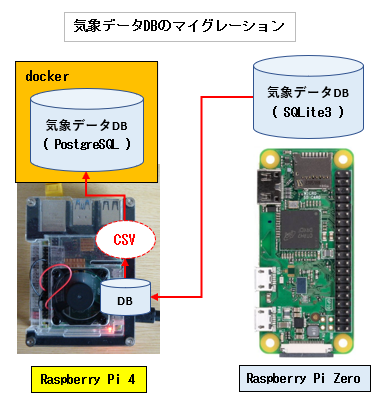

## SQLite3データベースをPostgreSQLデータベースにマイグレーションする

### 1. 気象データDBのマイグレーション

+ Raspberry Pi Zero の 気象データDB (SQLite3) を Raspberry Pi 4 上のdockerコンテナ上の PostgreSQL に移行する

<div>

</div>
<br/>

### 1-1. テーブルの差異

### 1-1-1. SQLite3テーブル

+ 測定時刻については Timestamp型がないので INTEGER型(Unix epoch値を格納)を使っています。  

```SQL
CREATE TABLE IF NOT EXISTS t_device(       -- 気象センサーデバイス名テーブル
    id INTEGER PRIMARY KEY AUTOINCREMENT,
    name VARCHAR UNIQUE NOT NULL           -- デバイス名はユニーク
);

CREATE TABLE IF NOT EXISTS t_weather(     -- 気象センサーデータテーブル
    did INTEGER NOT NULL,
    measurement_time INTEGER NOT NULL,    -- 測定時刻
    temp_out real,
    temp_in real,
    humid real,
    pressure real,
    PRIMARY KEY (did, measurement_time),
    FOREIGN KEY (did) REFERENCES t_devices (id) ON DELETE CASCADE
);
```

### 1-1-2 (1). PostgreSQLデータベース

+ センサーデータには

```SQL
CREATE ROLE developer WITH LOGIN PASSWORD 'yourpasswd';
ALTER ROLE developer WITH SUPERUSER;
CREATE DATABASE sensors_pgdb WITH OWNER=developer 
　　ENCODING='UTF-8' LC_COLLATE='ja_JP.UTF-8' LC_CTYPE='ja_JP.UTF-8' TEMPLATE=template0;
GRANT ALL PRIVILEGES ON DATABASE sensors_pgdb TO developer;
```

### 1-1-2 (2). PostgreSQLテーブル

+ データベースは気象センサー以外のセンサーデータも扱う予定なのでセンサー毎にスキーマを定義
+ 測定時刻はTimestamp型を使用  

```SQL
CREATE SCHEMA IF NOT EXISTS weather;         -- 気象センサーデータ用のスキーマ

CREATE TABLE IF NOT EXISTS weather.t_device(
   id INTEGER NOT NULL,
   name VARCHAR(20) UNIQUE NOT NULL,
   CONSTRAINT pk_device PRIMARY KEY (id)
);

CREATE TABLE IF NOT EXISTS weather.t_weather(
   did INTEGER NOT NULL,
   measurement_time timestamp NOT NULL,      -- 測定時刻
   temp_out REAL,
   temp_in REAL,
   humid REAL,
   pressure REAL
);

ALTER TABLE weather.t_weather ADD CONSTRAINT pk_weather PRIMARY KEY (did, measurement_time);

ALTER TABLE weather.t_weather ADD CONSTRAINT fk_device FOREIGN KEY (did) REFERENCES weather.t_device (id);

ALTER SCHEMA weather OWNER TO developer;
ALTER TABLE weather.t_device OWNER TO developer;
ALTER TABLE weather.t_weather OWNER TO developer;
```

### 1-2. データ移行でエクスポートされる各テーブルのCSVファイルの確認

#### 1-2-1. 気象センサーデバイス名テーブルから出力されるCSV
```
"id","name"
1,"esp8266_1"
```

#### 1-2-2. 気象センサーデータテーブルから出力されるCSV
```
"did","measurement_time","temp_out","temp_in","humid","pressure"
1,"2021-10-01 00:03:44",17.0,23.4,61.4,1004.7
1,"2021-10-01 00:13:28",17.0,23.3,61.4,1004.8
1,"2021-10-01 00:23:12",17.0,23.2,61.4,1005.0
...
```

### 1-3 CSV出力シェルスクリプト

コンソールから管理者が使用することを前提としているため入力チェックなど冗長なコードとなっています。

#### 1-3-1. 気象センサーデバイス名テーブルのCSV出力用シェルスクリプト

[getcsv_from_device.sh]
```bash
#!/bin/bash

readonly SCRIPT_NAME=${0##*/}

PATH_EXPORT_CSV="$HOME/Downloads/csv"

print_help()
{
   cat << END
Usage: $SCRIP_NAME OPTIONS
Execute GetCSVFromWeather.py OPTIONS

--output-path: Output csv file path is optional, default ~/Downloads/csv
--help	display this help and exit

Example:
  $SCRIPT_NAME --output-path abs_path 
END
}

print_error()
{
   cat << END 1>&2
$SCRIPT_NAME: $1
Try --help option
END
}

get_csv() {
cat<<-EOF | sqlite3 "$PATH_WEATHER_DB" -csv
    SELECT * FROM t_device ORDER BY id;
EOF
}

params=$(getopt -n "$SCRIPT_NAME" \
       -o o: \
       -l help -l output-path: \
       -- "$@")

# Check command exit status
if [[ $? -ne 0 ]]; then
  echo 'Try --help option for more information' 1>&2
  exit 1
fi
eval set -- "$params"

# init option value
output_path=$PATH_EXPORT_CSV

# Parse options
# Positional parameter count: $#
while [[ $# -gt 0 ]]
do
  case "$1" in
    -o | --output-path)
      output_path=$2
      shift 2
      ;;
    --help)
      print_help
      exit 0
      ;;
    --)
      shift
      break
      ;;
  esac
done

filename="device.csv"

header='"id","name"'
echo $header > "$output_path/$filename"
get_csv >> "$output_path/$filename"
if [ $? = 0 ]; then
   echo "Output device csv to $output_path/$filename"
   row_count=$(cat "${output_path}/${filename}" | wc -l)
   row_count=$(( row_count - 1))
   echo "Record count: ${row_count}" 
fi   
```

やってることは下記と同じです。  
※ --output-path が指定された場合、 "~/Downloads/csv" の部分が output-path に置き換わる  
```
echo '"id","name"' > ~/Downloads/csv/t_device.csv
echo "SELECT * FROM t_device" | sqlite3 weather.db -csv >> ~/Downloads/csv/t_device.csv
```

#### 1-3-2. 気象データテーブルのCSV出力用シェルスクリプト

[getcsv_from_weather.sh]
```bash

#!/bin/bash

readonly SCRIPT_NAME=${0##*/}

PATH_EXPORT_CSV="$HOME/Downloads/csv"

print_help()
{
   cat << END
Usage: $SCRIP_NAME OPTIONS
Execute GetCSVFromWeather.py OPTIONS

--device-name: ESP module device name is Required.
--from-date: SQL Criteria Start date in t_weahter is optional.
--to-date: SQL Criteria End date in t_weahter is optional.
--output-path: Output csv file path is optional, default ~/Downloads/csv
--help	display this help and exit

Example:
  $SCRIPT_NAME --device-name esp8266_1 --from-date 2021-08-01 --to-date 2021-09-30 --output-path abs_path 
  $SCRIPT_NAME --device-name esp8266_1 --from-date 2021-08-01 --output-path abs_path 
  $SCRIPT_NAME --device-name esp8266_1 --to-date 2021-09-30" --output-path abs_path 
  $SCRIPT_NAME --device-name esp8266_1 --output-path abs_path 
END
}

print_error()
{
   cat << END 1>&2
$SCRIPT_NAME: $1
Try --help option
END
}

next_to_date() {
    retval=$(date -d "$1 1 days" +'%F');
    echo "$retval"
}

# YYYYmmdd
suffix_datetime() {
    retval=$(date +'%Y%m%d');
    echo "$retval"
}

get_csv() {
    dev_name="$1";
    where="$2";
    # echo "dev_name: ${dev_name}"
    # echo "where: ${where}"
cat<<-EOF | sqlite3 "$PATH_WEATHER_DB" -csv
    SELECT
      did,
      datetime(measurement_time, 'unixepoch', 'localtime'), 
      temp_out, temp_in, humid, pressure
    FROM
      t_weather wh INNER JOIN t_device dv ON wh.did = dv.id
    WHERE
      dv.name='${dev_name}' AND (${where})
    ORDER BY measurement_time;
EOF
}

params=$(getopt -n "$SCRIPT_NAME" \
       -o d:f:t:o: \
       -l device-name: -l from-date: -l to-date: -l output-path: -l help \
       -- "$@")

# Check command exit status
if [[ $? -ne 0 ]]; then
  echo 'Try --help option for more information' 1>&2
  exit 1
fi
eval set -- "$params"

# init option value
device_name=
from_date=
to_date=
output_path=$PATH_EXPORT_CSV

# Parse options
# Positional parameter count: $#
while [[ $# -gt 0 ]]
do
  case "$1" in
    -d | --device-name)
      device_name=$2
      shift 2
      ;;
    -f |--from-date)
      from_date=$2
      shift 2
      ;;
    -t | --to-date)
      to_date=$2
      shift 2
      ;;
    -o | --output-path)
      output_path=$2
      shift 2
      ;;
    --help)
      print_help
      exit 0
      ;;
    --)
      shift
      break
      ;;
  esac
done

# Check required option: --device-name
if [ -z "$device_name" ]; then
  print_error "Required --device-name xxxxx"
  exit 1
fi

where=
if [ -n "$from_date" ] && [ -n "$to_date" ]; then
   next_date=$(next_to_date "$to_date");
   where=" measurement_time >= strftime('%s','"$from_date"','-9 hours') AND measurement_time < strftime('%s','"$next_date"','-9 hours')"
   range_from=$(echo "${from_date}" | sed 's/-//g') 
   range_to=$(echo "${to_date}" | sed 's/-//g') 
fi
if [ -n "$from_date" ] && [ -z "$to_date" ]; then
   where=" measurement_time >= strftime('%s','"$from_date"','-9 hours')"
   range=$(echo "${from_date}" | sed 's/-//g') 
fi
if [ -z "$from_date" ] && [ -n "$to_date" ]; then
   next_date=$(next_to_date "$to_date");
   where=" measurement_time < strftime('%s','"$next_date"','-9 hours')"
   range=$(echo "${to_date}" | sed 's/-//g') 
fi
if [ -z "$from_date" ] && [ -z "$to_date" ]; then
   where=" 1=1"
fi
date_part=$(suffix_datetime)
filename="weather.csv"

header='"did","measurement_time","temp_out","temp_in","humid","pressure"'
echo $header > "$output_path/$filename"
get_csv "$device_name" "$where" >> "$output_path/$filename"
if [ $? = 0 ]; then
   echo "Output weather csv to $output_path/$filename"
   row_count=$(cat "${output_path}/${filename}" | wc -l)
   row_count=$(( row_count - 1))
   echo "Record count: ${row_count}" 
fi   
```

#### 1-4-1. 

### 2. マイグレーションスクリプト

#### 2-1.Raspberry Pi 4 側


```
/home/pi/data/sql/
├── csv                      #  
├── getcsv_from_device.sh    # 1-3-1
├── getcsv_from_weather.sh   # 1-3-2
├── import_all_csv.sh        # PostgreSQL インポートスクリプト
└── sqlite3db
    └── weather.db          # 
```
